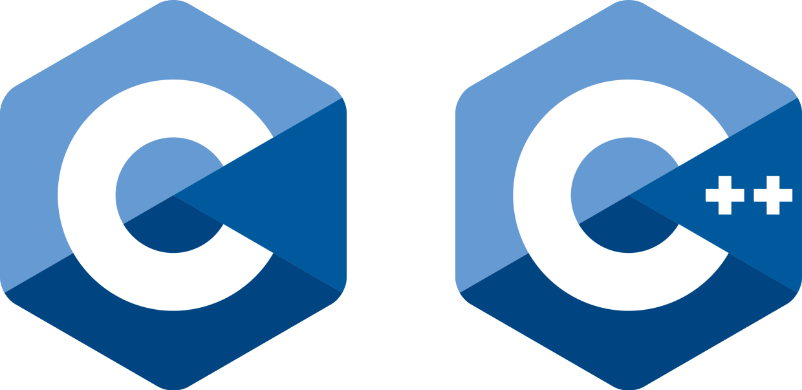

# C_Hub & CodeDriver[牧码南山C/C++团队]

​

---

### 历届负责人

现负责人员[2023 第六届]：👩‍💻徐铮[^Profile^](https://github.com/CGuitar)，👨‍💻张梦麒[^Profile^](https://github.com/WinternetQilin)；

往届负责人：

* 2022 第五届：

  🧑‍💻王智鹏；

### 开源仓库

Visual Studio 2022 IDE： [microsoft.com](https://visualstudio.microsoft.com/zh-hans/vs/)

---

持续更新 ...

‍
